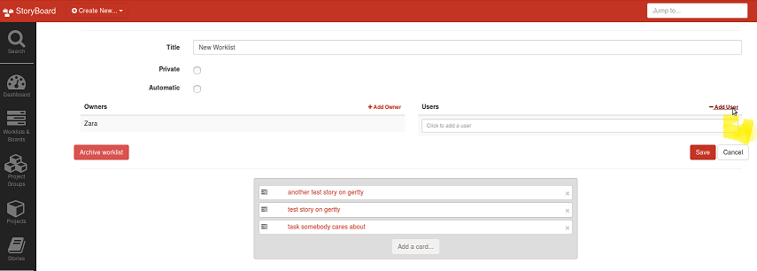
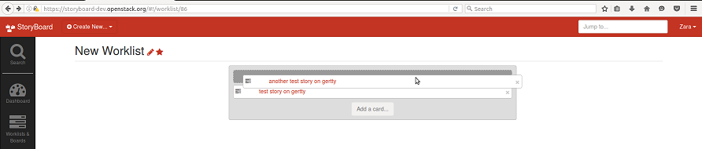
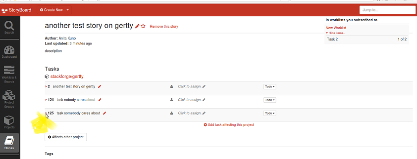
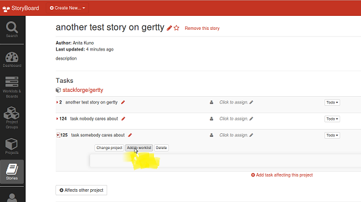
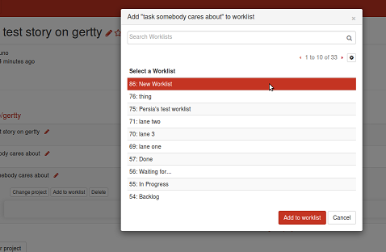
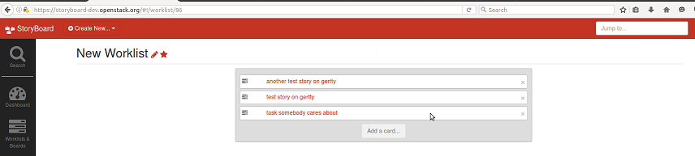
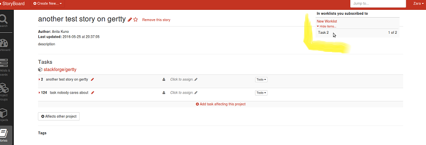
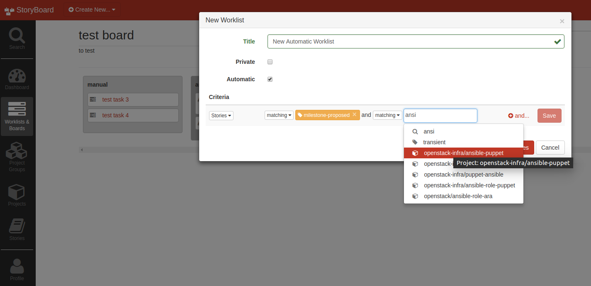

=================
 Using Worklists
=================

Basic Workflow
==============

Here's an example workflow for a project team:

#. Make a worklist:

   .. image:: _assets/create-worklist.png

#. Subscribe to it:

   .. image:: _assets/subscribe-worklist.png

#. Next, make a list of tasks you care about from existing stories, by
   adding cards to the worklist:

   .. image:: _assets/add-card-to-worklist.png

   .. image:: _assets/add-task-to-worklist.png

#. and save it:

   .. image:: _assets/save-worklist.png

It will look something like this:

.. image:: _assets/worklist-after-adding-tasks.png

Setting Permissions
===================

You can select users who are allowed to move things on the
worklist. To do so, edit the worklist:

.. image:: _assets/edit-worklist-perms-1.png

and add people whom you want to be able to interact with the worklist,
eg: to add users:

Setting Priorities
==================

You can drag and drop tasks in order of priority

This lets anyone who views your worklist see the priority of your
tasks, and anyone who subscribes to it see the priority of those tasks
when viewing affected stories.

Populating a Worklist Manually
==============================

You can also do it the other way round, adding existing stories to a
worklist you care about as you see them:

Browse to a story with a task you care about, and click the arrow next
to that task to expand detailed information and options for it:

Then the 'add to worklist' button:

And add the task to your chosen worklist for team priorities:

.. image:: _assets/add-task-to-worklist-4.png

If you go back to your worklist, that task will now be there!

On a story, tasks that feature in subscribed worklists will appear on
the top-right, along with their position in the worklist:

If you are not subscribed to any worklists containing tasks from the
story (or the story itself), that space will be empty, since we only
display this information to people who want it:

.. image:: _assets/story-with-no-worklist-subs.png

Once you have a team worklist, you can link the worklist on irc or on
the mailing list, etc, wherever it's most visible, and invite people
to subscribe!

Automatic Worklists
===================

You can make standalone automatic worklists or automatic worklists that
exist in a board. You set up criteria when you create the worklist to
funnel the relevant stories in the worklist. Criteria can be set up to
filter tasks or stories into an automatic worklist.  

If you have a board of automatic worklists, you can't manually move
the stories around from list to list, the criteria that makes it
appear in a certain worklist has to change for it to move. 

Worklist Notifications
======================

It is possible to subscribe to email notifications for worklists, so
that you can be kept up to date on changes in priority. These
notifications can be toggled in the profile preferences (person icon
on navbar, near the bottom) and are separate from the main email
notifications, to avoid things getting spammy. :)
