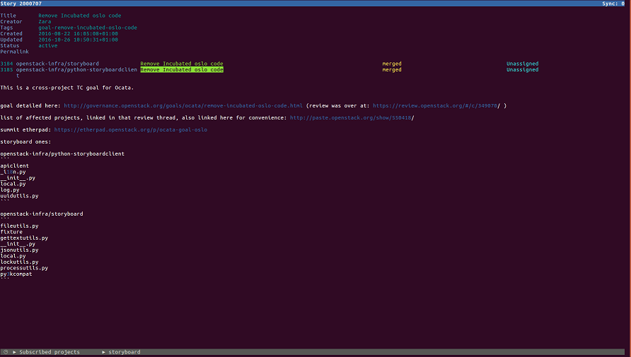
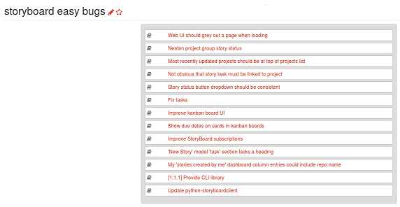
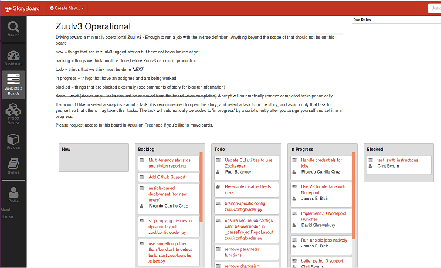
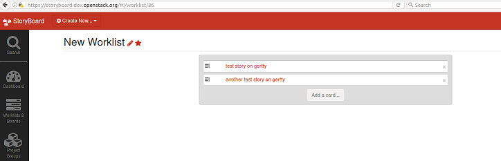
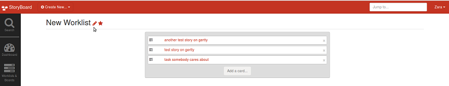
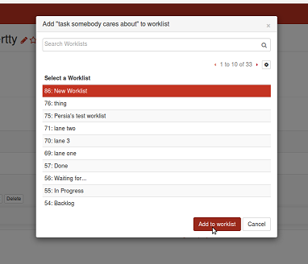
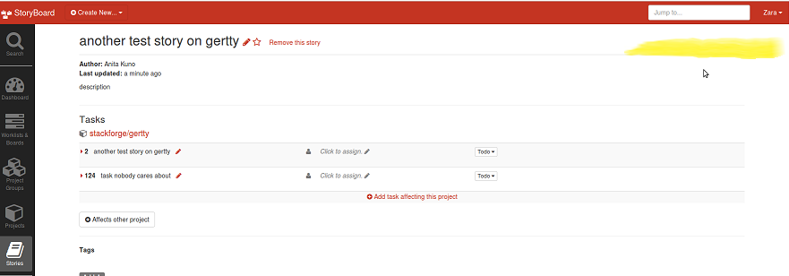

=========================================
 Things that StoryBoard does differently
=========================================

If you've been using Launchpad on your project, by now you're probably
aware of its norms and idiosyncracies. It can be hard to envisage
different ways of doing the same tasks when thinking in terms of
things that are possible in Launchpad, so this post aims to give an
overview of some of the interesting new features in StoryBoard that
don't have a Launchpad equivalent.

StoryBoard has been custom designed to fit the OpenStack use-case, and
so has several features built specifically around the OpenStack
community's needs. This post explains some of the key new things, so
that you can get familiar with the terminology, and construct
workflows that suit you -- hopefully by the end, you'll be as excited
as we are!

The REST API
============

StoryBoard has been developed with an API-first approach. What does
this mean? Well, at its core, StoryBoard has a python API. This then
plugs into a database, and can get information from it (or transmit
information to it). The StoryBoard API can then be accessed from
various clients, so that users can interact with some given database.

This means StoryBoard's features are first built on the API side, and
are then expressed in various clients. You can do more in the API than
in any given UI, since the UI just expresses the API.

Why does that matter?

Custom scripts! Custom UIs! If you can express it in a script, you can
fetch the data from StoryBoard. You don't have to rely on features in
any current UI if you have a niche request, and it's possible to build
your own new UI (or dashboard) if you want. You can also get info from
the commandline on the fly with a tool like curl.

There are some docs to illustrate usage here:

http://docs.openstack.org/infra/storyboard/webapi/v1.html

Moreover, as our API is generally RESTful, it's straightforward to
guess how to do things, and compatible with a lot of other tools with
minimal tinkering. Here are some sample, heavily commented scripts for
one simple example (commandline) interface, a python client:

https://review.openstack.org/#/c/371620/

There is also a much more fully-featured and interactive commandline
StoryBoard interface named boartty in progress over here, that jeblair
wrote on a plane:

The long and short of it is, if you know how to display data from a
REST API, you can display data from a StoryBoard instance.

You can do some fun things with this. For example, you could use
pygame if you wanted to depict stories as moving platforms or
something (I have publically said I'll try this, so I guess I've got
to follow through at some point). On that note, if anyone feels like
hacking something up, please tell us; we'd love it. Our irc channel is
irreverent and procrastinatory. You can find us in #storyboard.

Worklists and Boards
====================

StoryBoard introduces some new data models to meet the complex needs
of OpenStack.

Worklists are arbitrary groupings of stories and/or tasks with
whatever title the user wants. Each 'item' (story or task) is placed
on a 'card' on the worklist. Here is an example:

A worklist can be handy as a personal todo list. Anyone can make a
worklist, and the creator can decide who (if anyone) else can view and
edit it. It is possible to either populate a worklist manually, or
automatically populate it with stories or tasks that fulfil some
criteria (eg: 'assigned to Alice'. Here are some example filter
criterai for an automatic worklist:

.. image:: example-automatic-worklist-filters.png

We also have boards, which are akin to collections of
worklists. Here's an example:

You can name 'lanes' (lists) in the board what you want, and either
populate them as a visualisation of some data by making them
'automatic' (like worklists, populate them with stories or tasks that
meet some criteria), or manually move cards to and from non-automatic
lanes. This means you can use boards to visualise data, or you can use
them for a workflow like kanban if that's your thing. So, for example,
you might group various stories in different lanes according to
criteria, and then the board would function as an 'epic', tracking the
status of multiple stories. You can give a board a markdown
description if you want to provide more detail on the background. You
can even take a hybrid approach where you write custom scripts to move
cards around based on certain conditions.

Permissions for boards work the same way as worklist permissions. A
public board or worklist is visible to all, and editable for users and
owners. A private board or worklist is only visible to its users and
owners. Users can move and delete cards, but only owners can delete
lanes or change the metadata of the board itself (eg: its title or
description).

Complex Priority
================

We already wrote a massive email on this, intended as a thorough
overview, so we are going to shamelessly copy and paste it here. The
crux is that in StoryBoard, it's possible for different people to say
'this is a priority for us', so that a task can have different
priorities, tailored to different audiences.

So, why is this useful?

Previously, StoryBoard allowed users to assign one priority to each
task ('high', 'medium' or 'low'). The implementation meant that anyone
could change a task's priority, and this would be seen by everyone
viewing the task. There was no way to say 'you can only change this
priority if you have discussed this on irc and it has been agreed
among the project team', etc. This meant that people with no context
could alter global priority of tasks. Also, two different groups might
prioritize tasks differently, and this could result in long
prioritization sessions, where the real question was 'whose priorities
matter most?' (and often the answer was 'it depends on who the
audience is', so these arguments would result in a stalemate)

So, StoryBoard now has a way to say 'this task matters to me'. We use
worklists to express priority: if you manually add tasks to a
worklist, you can drag and drop them in order of priority. This has
the side effect that you can see how prioritizing one task affects the
priority of other tasks; you can only have one item at the top, and
putting anything high on the list will push other things down. It is
possible for others to subscribe to the worklists of those individuals
or teams whose priorities they care about; then, whenever they browse
to a story, they will see if any of the tasks are on those lists, and
what position the tasks are on the list.

Worklists have permissions, so it is possible to set up a project team
list on which items can only be moved by contributors selected by core
reviewers, etc. This stops everyone changing the priority of tasks
without discussion.

This is very new, and we're excited to see how people use it. We've
lost some ease in assigning priority in favour of finer grained
representation of priority. In the past, StoryBoard did show lots of
different people's priorities, it just didn't offer any way of
tracking whose priorities were whose. So this makes things more open
and explicit. We hope to tailor the implementation based on user
feedback, and these are the first steps! :)

Here's an example workflow for a project team:

#. Make a worklist:

   .. image:: create-worklist.png

#. Subscribe to it:

   .. image:: subscribe-worklist.png

#. Next, make a list of tasks you care about from existing stories, by
   adding cards to the worklist:

   .. image:: add-card-to-worklist.png

   .. image:: add-task-to-worklist.png

#. and save it:

   .. image:: save-worklist.png

It will look something like this:

You can select users who are allowed to move things on the
worklist. To do so, edit the worklist:

and add people whom you want to be able to interact with the worklist,
eg: to add users:

.. image:: edit-worklist-perms-2.png

You can drag and drop tasks in order of priority

.. image:: drag-n-drop-on-worklist.png

This lets anyone who views your worklist see the priority of your
tasks, and anyone who subscribes to it see the priority of those tasks
when viewing affected stories.

You can also do it the other way round, adding existing stories to a
worklist you care about as you see them:

Browse to a story with a task you care about, and click the arrow next
to that task to expand detailed information and options for it:

.. image:: add-task-to-worklist-1.png

Then the 'add to worklist' button:

.. image:: add-task-to-worklist-2.png

And add the task to your chosen worklist for team priorities:

.. image:: add-task-to-worklist-3.png

If you go back to your worklist, that task will now be there!

.. image:: add-task-to-worklist-5.png

On a story, tasks that feature in subscribed worklists will appear on
the top-right, along with their position in the worklist:

.. image:: worklist-subs-on-story.png

If you are not subscribed to any worklists containing tasks from the
story (or the story itself), that space will be empty, since we only
display this information to people who want it:

Once you have a team worklist, you can link the worklist on irc or on
the mailing list, etc, wherever it's most visible, and invite people
to subscribe!

It is possible to subscribe to email notifications for worklists, so
that you can be kept up to date on changes in priority. These
notifications can be toggled in the profile preferences (person icon
on navbar, near the bottom) and are separate from the main email
notifications, to avoid things getting spammy. :)

Thanks for reading, and we hope this has been useful.

Have fun, and happy task-tracking!
